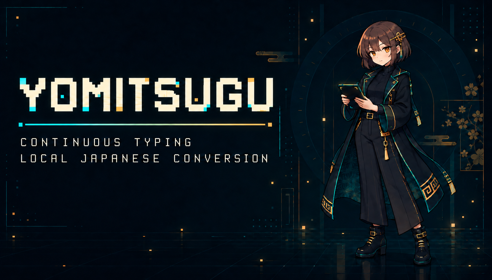
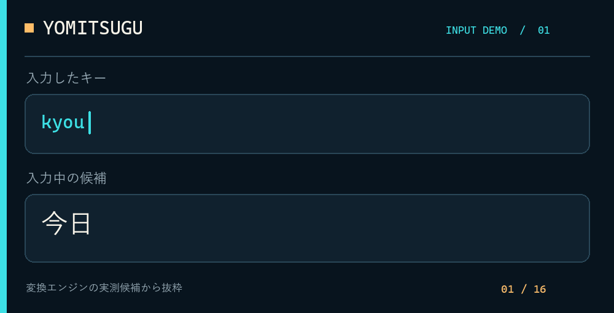
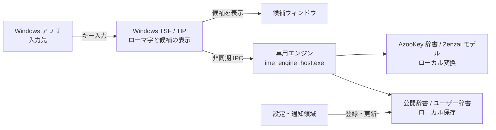

# Yomitsugu

ローマ字を打ち続けながら、日本語に変換する Windows IME。

  
  
  
  
  

**[動いているところ](#動いているところ)** · **[何ができるか](#何ができるか)** · **[アーキテクチャ](#アーキテクチャ)** · **[インストール](#インストール)** · **[現在の範囲](#現在の範囲)** · **[ライセンス](#ライセンス)**

---

## 動いているところ

<picture>
  <source media="(prefers-reduced-motion: reduce)" srcset="docs/assets/readme/input-demo-still.png">
  
</picture>

変換エンジンの実測候補から、読みやすい時点を抜粋して並べました。入力中に候補がどう変わるかを示す図解です。アプリ画面の録画や Chrome・Office での動作を示す映像ではありません。

## 何ができるか

| 入力 | 変換例 |
| --- | --- |
| `kyouhaiitennkidesune.` | 今日はいい天気ですね。 |
| `APIwokakuninshitekudasai.` | APIを確認してください。 |
| `samukunaltutekimasitane` | 寒くなってきましたね |
| `ri-domi-` | README |
| `ri-domi-wokousinnsitekudasaiGithubde` | READMEを更新してくださいGithubで |
| `sannkai` | 散開（先頭候補） |
| `yajirushi` | → |
| `ltu` / `a` / `.` | っ / あ / 。 |

英語と日本語の境目を探し、かな漢字変換には AzooKey の辞書と Zenzai のローカルモデルを使います。ユーザー辞書の登録・編集・TSV取り込み、記号を含む公開辞書の更新は設定画面から行えます。辞書更新で取得するのは公開データだけです。入力文と個人辞書は送信しません。

## アーキテクチャ

TIP は入力先アプリ内で動き、変換処理は専用プロセスへ渡します。公開辞書の更新時だけ公開データを取得します。[拡大・経路表示ができる詳細図](docs/architecture/yomitsugu.html) もあります（HTML をダウンロードして開いてください）。

## インストール

現在は**評価版**です。`main` の更新時に [Windows CI](.github/workflows/windows.yml) が `installer-preview` を実行し、成功した実行の成果物からインストーラーを取得できます。リポジトリ管理者は「Run workflow」から再実行できます。インストーラーは未署名で、管理者権限が必要です。通常のリリース欄には、まだバイナリを置いていません。

インストール後、Windows の入力切替で Yomitsugu を選びます。通知領域のアイコン（隠れている場合は `^` の中）から設定と辞書を開けます。標準の「あ」インジケーターへの表示は環境によって異なります。アンインストールは Windows の「インストールされているアプリ」から行えます。ユーザー辞書は削除しません。

以前の PowerShell 版プレビューを入れている場合は、先にその版の `uninstall_preview.ps1` で登録を解除してください。使用中のアプリは古い DLL を保持するため、切替後はサインアウトしてから使うのが確実です。

## 現在の範囲

0.2.7-preview では、長い英日混在入力と `sannkai` の候補順位を修正しました。単一の Rich Edit ホストでの TIP E2E は **32件成功・0件失敗**。ネイティブの品質試験は46/46、配布試験は105/105、Python受入シードは32/32です。これらはこのテスト環境での結果です。

Chrome、Office、VS Code などでの継続入力はまだ調べ切れていません。文節の伸縮・再変換と正式な候補 UI Automation も未完成です。常用や一般配布の完成を宣言する段階ではありません。詳しい結果と残課題は [RELEASE.md](RELEASE.md) にまとめています。

## ソースとビルド

TIP・変換エンジン・設定画面は `native/` にあります。`src/ime_mixed/` は Python で作った初期の変換実験です。CI は Windows でソースのビルドとテストを行います。インストーラー生成では、固定リビジョンの myime、AzooKey の辞書、Swift ランタイム、Zenzai モデルを取得してハッシュを確認します。ローカルでの手順と検証コマンドは [RELEASE.md](RELEASE.md) を参照してください。

## ライセンス

独自コードは [MIT](LICENSE) です。AzooKey、myime、モデル、Mozc・EDRDG・Unicode 由来の辞書データには別の条件があります。同梱物の出典とライセンスは [THIRD_PARTY.md](THIRD_PARTY.md) に記載しました。Yomitsugu はこれらのプロジェクトの公式製品ではありません。
