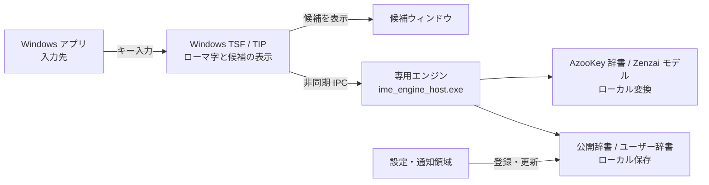

# Yomitsugu

ローマ字を打つそばから、日本語に変える Windows IME。

  
  
  
  
  

**[Windows 版をダウンロード（0.2.8 Preview）](https://github.com/urotsuki-san/Yomitsugu/releases/download/v0.2.8-preview.1/Yomitsugu-0.2.8-preview-x64-setup.exe)**

**[動いているところ](#動いているところ)** · **[何ができるか](#何ができるか)** · **[アーキテクチャ](#アーキテクチャ)** · **[インストール](#インストール)** · **[現在の範囲](#現在の範囲)** · **[ライセンス](#ライセンス)**

---

## 動いているところ

<picture>
  <source media="(prefers-reduced-motion: reduce)" srcset="docs/assets/readme/input-demo-still.png">
  
</picture>

打ち続けると、入力中の文字列が日本語へ変わっていきます。英語を交えた文章も、そのまま入力できます。

## 何ができるか

| 入力 | 変換例 |
| --- | --- |
| `kyouhaiitennkidesune.` | 今日はいい天気ですね。 |
| `APIwokakuninshitekudasai.` | APIを確認してください。 |
| `samukunaltutekimasitane` | 寒くなってきましたね |
| `ri-domi-` | README |
| `aninsuto-ru` | アンインストール |
| `softwarewokoushinsuru` | softwareを更新する |
| `ri-domi-wokousinnsitekudasaiGithubde` | READMEを更新してくださいGithubで |
| `sannkai` | 散開（先頭候補） |
| `yajirushi` | → |
| `ltu` / `a` / `.` | っ / あ / 。 |

英語を交えた文章を、モードを切り替えずに入力できます。候補は入力中に変わり、`Space` で選んで `Enter` で確定します。

よく使う名前や用語はユーザー辞書に登録できます。公開辞書も設定画面から更新できます。変換はPC内で処理し、入力文やユーザー辞書を外部へ送信しません。

## アーキテクチャ

入力先アプリでキーを受け取り、専用プロセスで変換します。辞書には AzooKey、候補の評価には Zenzai を使います。通信するのは公開辞書を更新するときです。[拡大・経路表示ができる詳細図](docs/architecture/yomitsugu.html) もあります（HTML をダウンロードして開いてください）。

## インストール

現在は**評価版**です。

1. [Windows 用インストーラーをダウンロード](https://github.com/urotsuki-san/Yomitsugu/releases/download/v0.2.8-preview.1/Yomitsugu-0.2.8-preview-x64-setup.exe)します。
2. ダウンロードした `.exe` を実行し、画面の案内に従います。管理者権限が必要です。未署名のため、Windows が警告を表示する場合があります。
3. インストール後、`Win` + `Space` で Yomitsugu を選びます。

設定は通知領域の Yomitsugu アイコンを右クリックして開きます。アイコンが見当たらない場合は、`^` の一覧かスタートメニューの「Yomitsugu → 設定と辞書」を開いてください。

削除する場合は Windows の「インストールされているアプリ」で Yomitsugu を選びます。ユーザー辞書は残ります。

## 現在の範囲

Windows x64向けの評価版です。ローマ字入力、英日混在の変換、候補の選択、文字種の変換、辞書の編集に対応しています。公開辞書には一般語・外来語・記号など約30万項目を収録しています。

文脈による同音語の選択や、複数箇所のタイプミスには改善の余地があります。文節の伸縮と確定後の再変換は開発中です。[使い方](RELEASE.md)と[変換品質の測定結果](docs/conversion-quality.md)も参照してください。

## ソースとビルド

入力処理・変換エンジン・設定画面は `native/`、変換の実験用コードは `src/ime_mixed/` にあります。WindowsでCMakeとMSVCを使ってビルドします。依存ファイルの取得からインストーラーの生成までの手順は[開発ガイド](docs/development.md)を参照してください。

## ライセンス

独自コードは [MIT](LICENSE) です。AzooKey、myime、モデル、Mozc・EDRDG・Unicode 由来の辞書データには別の条件があります。出典とライセンスは [THIRD_PARTY.md](THIRD_PARTY.md) に記載しています。Yomitsugu はこれらのプロジェクトの公式製品ではありません。
